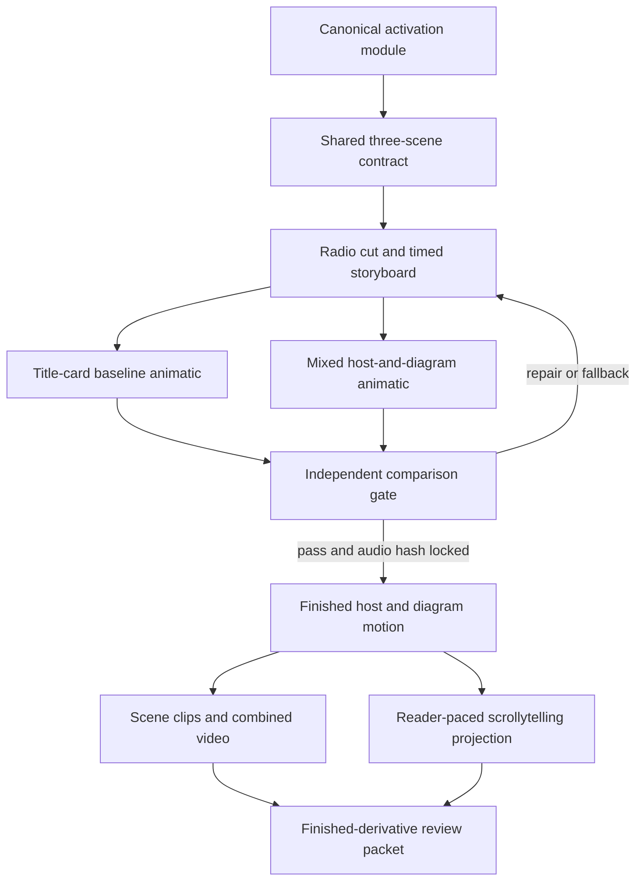
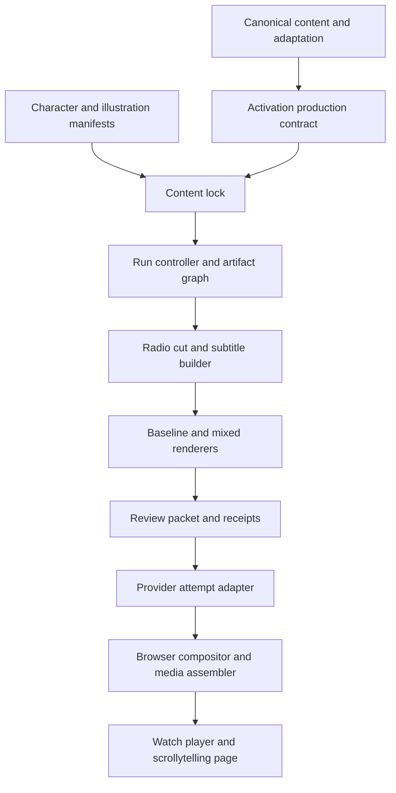
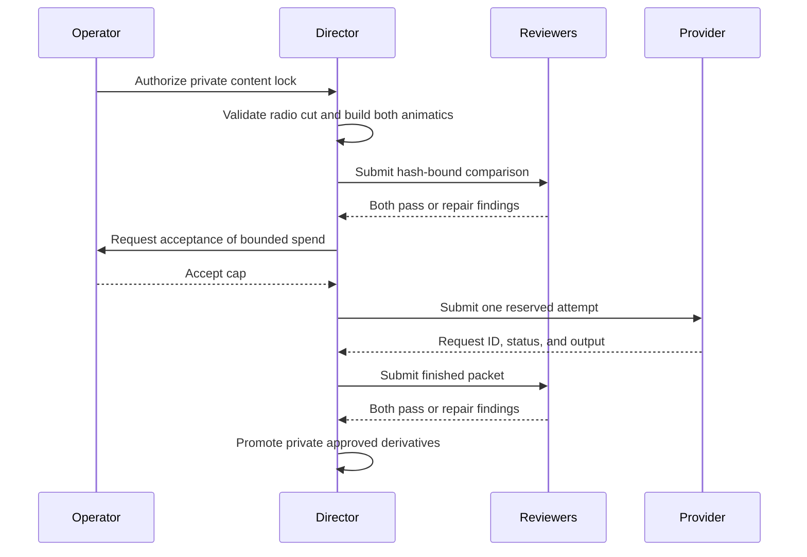
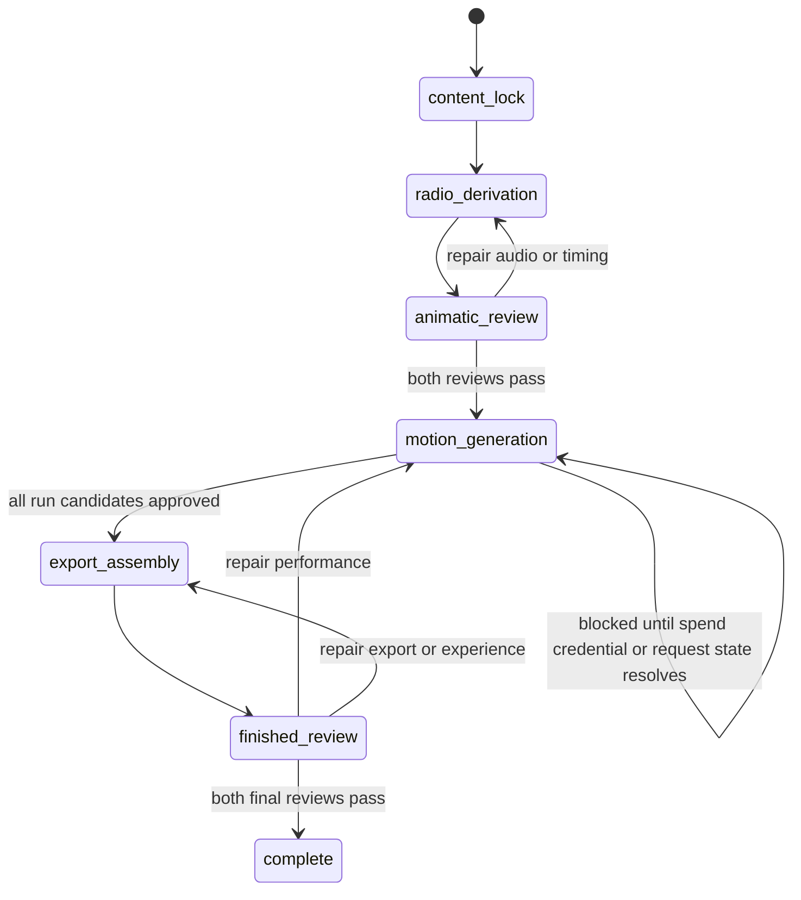
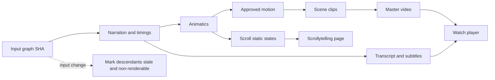
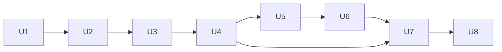

# Autonomous Activation Production Milestone - Plan

## Goal Capsule

- **Objective:** A private reviewer can experience the complete three-beat activation explanation as a coherent mascot-guided video and a reader-paced scrollytelling guide, with finished motion produced only after the mixed host-and-diagram grammar proves at least as usable as the current title-card treatment.
- **Means:** One hash-locked activation production graph feeds the radio cut, controlled animatics, approved motion, finished video, and scrollytelling page (KTD2, KTD3, KTD7).
- **Product authority:** The canonical activation module remains authoritative. R4, R6, and R7 create a narrow host-led exception to the existing caption-only placement rule; all other clinical, design, and patient-usability gates remain authoritative.
- **Execution profile:** Complete the private milestone autonomously, but stop before paid generation without an accepted budget and before promotion without hash-bound review receipts.
- **Stop conditions:** Stop as `blocked`, `partial`, or `pending_review` when a required dependency, provider result, reviewer pass, or authorized limit is unavailable; never weaken a gate to continue (KTD2, KTD8, KTD10).
- **Tail ownership:** The autonomous director owns revisions through passing independent designer and simulated-user reviews. The production operator owns spend authorization and any future clinical or public-release approval.

---

## Product Contract

### Summary

Produce an autonomous activation pilot with two host-led Dr. Hoots scenes and one diagram-led programming scene.
Prove the scene grammar with a controlled animatic comparison before producing finished motion, then project the same approved beats into an exportable video and accessible scrollytelling guide.

### Problem Frame

The current activation prototype already has canonical copy, three ordered scenes, provisional narration, one programming diagram, a captioned player, and reversible scrollytelling.
Its non-illustrated video scenes use title cards, while the caption avatar plays a silent four-second loop that explicitly lacks speech and beak movement.

Producing a complete guide before resolving the host-versus-diagram grammar would scale an unproven presentation choice across clinical scenes with higher review cost.
The activation slice can test the directing system without introducing wound-care animation or unsupported activation timing.

### Key Decisions

- **Prove activation before scaling.** (session-settled: user-directed — chosen over immediate production of all 14 scenes: the smaller slice proves the complete pipeline before higher-risk clinical media.) Governs R1 and R19.
- **Use host-led and diagram-led scene templates.** (session-settled: user-approved — chosen over keeping non-illustrated scenes as title cards: Dr. Hoots should explain and connect text-led beats while diagrams own visually explanatory beats.) Governs R4 through R8.
- **Treat the animatic comparison as evidence.** (session-settled: user-approved — chosen over assuming the mixed grammar is better from design intuition: finished motion proceeds only after an independent comparison.) Governs R9 through R11.
- **Keep one clinical source of truth.** Format-specific pacing, navigation, and motion may differ, but no derivative may create a new clinical proposition. Governs R2, R3, and R15.

<!-- ce-section: work-relationships -->
### How This Work Fits Together

This plan owns the autonomous activation production milestone; the broader sequence below is context, not a committed roadmap.

- **Activation milestone:** Proves the shared scene authority, two video templates, animatic gate, export, and scrollytelling projection.
  - **When-to-call milestone:** Depends on a passing activation pipeline and adds safety lookup, fever-threshold, phone-routing, and replay behavior.
  - **Wound-care milestone:** Depends on partner-surgeon review before any clinical technique illustration or motion is eligible to render.
  - **Full-guide production:** Depends on the later module milestones and can revise how scenes are grouped without changing their clinical authority.

### Actors

- A1. **Simulated-user reviewer:** A fresh isolated subagent role that evaluates the experience as an adult patient or caregiver proxy with no assumed cochlear-implant vocabulary; it is not real-patient research.
- A2. **Independent design reviewer:** A fresh isolated subagent role that checks information hierarchy, character integrity, motion restraint, accessibility, and private-prototype labeling; it does not grant clinical approval.
- A3. **Production operator:** Authorizes the source content and gates, supplies bounded generation credentials and budget, and receives the review packet.
- A4. **Autonomous director:** Builds deterministic derivatives, requests bounded generated media, records provenance, assembles outputs, runs validations, and stops at failed gates.

### Requirements

**Content and scene authority**

- R1. The milestone covers `ci/activation` in the existing order: healing, first programming visit, and follow-up.
- R2. Narration, captions, visible text, and scrollytelling copy must resolve to the same canonical sentence and source-claim IDs, with no added activation timing, outcome, or device-behavior claim.
- R3. One shared scene definition must drive the animatic, finished video, and scrollytelling guide; only pacing, navigation, and motion may vary by format.

**Video scene grammar**

- R4. A host-led scene must place Dr. Hoots in the main stage visibly speaking and using restrained non-clinical head or wing gestures while synchronized live captions carry every spoken word.
- R5. A diagram-led scene must place the claim-mapped safety-card diagram in the main stage and show a centered, visibly speaking Dr. Hoots avatar beside the synchronized live caption.
- R6. Healing and follow-up are host-led; the first programming visit is diagram-led.
- R7. A host-led scene must not duplicate Dr. Hoots in the caption avatar, while a diagram-led scene retains the caption avatar as speaker identity.
- R8. Dr. Hoots may welcome, count, point toward information, or direct attention, but no gesture, expression, or motion may carry a clinical fact or demonstrate clinical technique.

**Animatic and evidence gate**

- R9. Production must create and automatically validate a narration-led radio cut and timed storyboard before generating animatics or finished motion; the radio cut is an internal dependency, not a separate human review gate.
- R10. The animatic review must compare the mixed host-and-diagram cut with a title-card baseline using identical clinical copy, narration, captions, scene order, and timing, and a pass locks the exact narration and timing hashes for finished motion.
- R11. The mixed cut may advance only when a fresh independent designer and a fresh simulated-user reviewer both find no critical patient-usability failure, no regression in orientation, task comprehension, recall, or accessibility, and no delay or distraction caused by Dr. Hoots.

**Production outputs**

- R12. The approved narration must provide exact text and word-level timing for live caption highlighting, speaker motion, transcript, and subtitle exports.
- R13. Dr. Hoots must remain recognizable and optically centered at the main-stage and 64px/48px avatar sizes; reduced motion must substitute a stable approved frame without losing any content.
- R14. The production packet must include the approved radio cut, both comparison animatics, three individual finished scene clips, one combined MP4 master, poster or static fallback frames, a transcript, and VTT or SRT captions.
- R15. The scrollytelling guide must reuse the approved scene order, copy, and diagram assets as reader-paced beats with reversible back-scrolling, paired mobile visuals, a useful no-JavaScript reading order, and complete reduced-motion states.
- R16. The finished video must play from one action, support pause, seek, replay, progress, speed, and optional patient-language chapters, keep captions visible throughout speech, and remain under 180 seconds.

**Autonomy and safety**

- R17. The autonomous director must stop at content lock, animatic comparison, and finished-derivative review gates rather than treating artifact generation or automatic radio validation as approval.
- R18. Every generated asset must record its source, prompt, model, request identifier, relevant seed or settings, output hash, review state, and rejection reason; rejected media must never become active by filename alone.
- R19. The director must keep the milestone visibly private and unverified, block patient-ready claims and unapproved clinical visuals, and preserve static live-text fallbacks when media is blocked or rejected.
- R20. A content or adaptation change must invalidate stale narration, captions, animatics, clips, and manifests until they are rebuilt and the applicable validators pass.
- R21. Generation must use explicit attempt and spending limits, stop when either limit is reached, and return a precise partial or blocked state instead of silently weakening a gate.

### Production Flow



### Key Flows

- F1. **Build the comparison packet**
  - **Trigger:** A3 authorizes the canonical activation content for private concept production.
  - **Actors:** A3, A4
  - **Steps:** Build the radio cut, map timestamps, create the shared storyboard, and render the baseline and mixed animatics with controlled content and timing.
  - **Outcome:** A reviewable pair isolates the scene-grammar difference.
  - **Covers:** R1 through R3 and R9 through R10.
- F2. **Gate finished motion**
  - **Trigger:** Both animatics are complete.
  - **Actors:** A1, A2, A4
  - **Steps:** Fresh designer and simulated-user reviewers assess the same hash-bound comparison, and the director either authorizes finished motion or returns the failed scene for repair or fallback.
  - **Outcome:** Motion spend follows evidence rather than intuition.
  - **Covers:** R8, R11, R17, and R21.
- F3. **Experience the mascot-guided video**
  - **Trigger:** A1 selects Play or opens a chapter.
  - **Actors:** A1
  - **Steps:** The video moves through host-led, diagram-led, and host-led scenes with synchronized narration, visible captions, clear controls, and reversible seeking.
  - **Outcome:** A1 can restate what happens at the programming visit and follow-up without relying on motion or mascot interpretation.
  - **Covers:** R4 through R8, R12 through R14, and R16.
- F4. **Read the scrollytelling guide**
  - **Trigger:** A1 opens the reader-paced format and scrolls in either direction.
  - **Actors:** A1
  - **Steps:** Each short text beat remains paired with its approved static visual state, and reverse scrolling restores the prior beat.
  - **Outcome:** A1 receives the same propositions without timed playback or presenter motion.
  - **Covers:** R2, R3, R15, and R19.
- F5. **Handle a failed generation**
  - **Trigger:** A generated host or motion asset drifts, fails review, or exhausts its attempt or spending limit.
  - **Actors:** A2, A3, A4
  - **Steps:** Record the rejected output, preserve the prior approved fallback, classify the milestone as partial or blocked, and stop or retry only within the authorized bounds.
  - **Outcome:** Automation cannot convert a failed asset into an implicit approval.
  - **Covers:** R17 through R21.

### Acceptance Examples

- AE1. **Host-led healing scene**
  - **Covers:** R4, R6 through R8, R12, and R13.
  - **Given:** The healing scene is active in the video.
  - **When:** Narration begins.
  - **Then:** Main-stage Dr. Hoots visibly speaks and makes one restrained non-clinical gesture, no duplicate avatar appears, and the complete proposition remains in the synchronized caption.
- AE2. **Diagram-led programming scene**
  - **Covers:** R5 through R8 and R12 through R13.
  - **Given:** The programming scene is active.
  - **When:** The audiologist and external-processor proposition is narrated.
  - **Then:** The approved safety-card diagram owns the main stage and the optically centered caption avatar visibly speaks without obscuring the caption.
- AE3. **Reduced-motion playback**
  - **Covers:** R13, R15, R16, and R19.
  - **Given:** Reduced motion is enabled.
  - **When:** A1 watches or reads the activation sequence.
  - **Then:** Approved static states replace presenter and diagram motion while every proposition, control, caption, and scene relationship remains available.
- AE4. **Mixed animatic does not win**
  - **Covers:** R10, R11, R17, and R21.
  - **Given:** The mixed animatic causes slower orientation, lower recall, an accessibility regression, or mascot distraction.
  - **When:** The independent comparison is recorded.
  - **Then:** Finished motion does not start; the failed scene returns for repair or uses the title-card fallback before another comparison.
- AE5. **Source copy changes**
  - **Covers:** R2, R12, R18, and R20.
  - **Given:** Any canonical or adapted activation sentence changes.
  - **When:** A4 attempts to render an older narration, caption, animatic, or clip.
  - **Then:** The derivative is marked stale and blocked until rebuilt against the new content identity.
- AE6. **Character drift**
  - **Covers:** R8, R13, R17 through R19, and R21.
  - **Given:** A generated speaking or gesturing performance changes Dr. Hoots's face, beak, anatomy, scrubs, pin, texture, or framing.
  - **When:** The finished-derivative gate runs.
  - **Then:** The performance is rejected, its reason is recorded, and the approved static or rigged fallback remains active.

### Scope Boundaries

- The other 11 scenes, including all when-to-call and wound-care production, are deferred to later milestones.
- Patient-ready wording, clinical approval, public publication, and real-patient research are outside this private concept milestone.
- Final voice casting, localization, an editor or composer interface, and unrestricted autonomous generation are deferred.
- Animated Dr. Hoots presentation inside the scrollytelling guide is not required; host-led video scenes project to complete text-led static scroll states.
- No wound-care technique or other clinical action is depicted by Dr. Hoots.

### Dependencies and Assumptions

- The canonical activation module and shared scene manifest remain the source of truth.
- The existing programming-visit concept illustration is eligible only for the visibly unverified private prototype.
- The approved character sheets, gesture vocabulary, and layered clay rig are design references, not clinical approvals.
- Generated media requires an authorized provider credential and a production budget; provider choice does not change the requirements.
- The existing patient-usability rubric is a simulated gate and does not substitute for research with patients or partner-surgeon approval.

### Sources and Research

- `README.md` — private-prototype and clinical-approval boundary.
- `content/canonical/ci-phase0-v0.1.0.json` — canonical activation propositions and unresolved timing conflict.
- `content/scenes/ci-phase0-v0.1.0.scenes.json` — shared scene order and timing targets.
- `assets/variations.js` — current title-or-illustration rendering, separate host video, narration synchronization, and shared watch/scroll scene loading.
- `assets/video/manifest.json` — active silent host clip and rejected attempts.
- `assets/character/manifest.json` — design-approved gesture vocabulary and layered rig references.
- `docs/MEDIA_VARIATION_BUILD.md` — shared-scene, format, accessibility, and review constraints.
- `docs/EVALUATION_GATES.md` — character, media, clinical-drift, and automatic-failure rules.
- `docs/PATIENT_USABILITY_RUBRIC.md` — simulated-patient comparison criteria and critical failures.
- `https://fal.ai/models/fal-ai/kling-video/ai-avatar/v2/standard/api` — current audio-driven avatar endpoint, stylized-character support, request fields, and cost basis for KTD5 and KTD9.
- `https://fal.ai/models/fal-ai/sync-lipsync/v3/api` — current video-and-audio lip-sync fallback contract and synchronization modes.

---

## Planning Contract

The user-directed R9-R11 revision removes a standalone human radio gate; all other Product Contract meaning and stable IDs are preserved. The first implementation unit reconciles the older caption-only placement language with the narrow host-led exception before any renderer changes.

### Key Technical Decisions

- KTD1. **Separate clinical content from production treatment.** Add a versioned activation production contract that references canonical scene, sentence, and claim IDs without adding private production grammar to the clinically blocked visual manifest. Amend the three existing gate documents so host-led healing and follow-up are the only main-stage mascot exception. Covers R1 through R8 and R19.
- KTD2. **Use an immutable hash-bound production graph.** One content lock binds the canonical module, activation adaptation, scene contract, character and illustration manifests, render configuration, and tool versions. Every downstream artifact records its direct input hashes, and changed inputs make descendants `stale_nonrenderable`. Covers R2, R3, R18, and R20.
- KTD3. **Let animatic approval lock the radio cut.** Automatically validate narration text, timestamps, and subtitle derivation, then build both animatics from the same radio-cut hash. A passing comparison gate, evidenced by both required receipts, locks that audio for paid motion; there is no separate human radio approval. (session-settled: user-directed — chosen over a standalone radio-review step: the animatic review can judge pacing and scene grammar together before paid generation.) Covers R9 through R12 and R17.
- KTD4. **Mechanically isolate the comparison treatment.** One comparison manifest binds scene order, audio, captions, global timeline, canvas, type, and diagram assets. Only healing and follow-up may differ: baseline uses title card plus caption avatar, while mixed uses host-led stage without a caption avatar. Programming is identical in both. Covers R6, R7, R10, and R11.
- KTD5. **Create audio-driven character attempts with the concrete FAL client.** Use the approved Dr. Hoots motion base and locked scene audio with the selected audio-driven image-to-video endpoint; extract a provider interface only if a second provider is added. Layer the approved restrained wing rig only when the generated performance preserves identity. Accept at most one output-frame of container-duration variance, trim only visual excess or hold an approved final frame within that tolerance, and reject larger timeline, lip-sync, or character drift without changing narration. Covers R4, R5, R8, R12, R13, and R18.
- KTD6. **Checkpoint and contain paid motion work.** Each paid motion attempt follows `reserved`, `submitted`, `provider_pending`, `succeeded_unreviewed`, and a terminal review state. Serialize run writers, durably commit the reservation and client idempotency key before submit, and atomically commit each later transition. Persist the provider request ID immediately after receipt. If the provider cannot look up the client key and the submit response is lost before a request ID arrives, hold the reservation as `unknown_unreconcilable`, prohibit automatic retry, and block for operator reconciliation. Covers R18 and R21.
- KTD7. **Render every derivative from one deterministic timeline.** Use `agent-browser` recording against a loopback-only, token-protected run server for browser composition, then use `ffmpeg` and `ffprobe` to normalize, assemble, and inspect the media. Bind the tool and browser versions, OS identifier, font hashes, viewport, and device-pixel ratio into the content lock. Subtitle files and live word highlighting derive from the same timestamps, and the approved master becomes the finished watch experience's single media clock. Determinism means identical locked inputs and timeline semantics, not byte-identical video encoding. Covers R3 and R12 through R16.
- KTD8. **Make independent reviews hash-bound and repeatable.** Fresh designer and simulated-user subagents receive identical artifact packets in isolated contexts. The controller issues a single-use challenge bound to the packet, role, and launched evaluator, and accepts the receipt only through that return channel. Each receipt records reviewer role, evaluator ID, rubric version, reviewer-prompt hash, model/version, inference configuration, allowed-tool policy, artifact hashes, per-dimension findings, critical failures, and disposition. Both roles must pass the animatics and finished outputs. A repair creates a new artifact revision, records how it addresses every prior failure, and requires new receipts; an unchanged packet is ineligible for re-review. (session-settled: user-directed — chosen over an unstructured single review: independent role-specific review should drive revisions until the artifacts pass.) Covers R11, R17, R19, and R20.
- KTD9. **Bound generation and review before starting.** The run has a hard provider-spend cap of USD 15, at most three paid attempts per host-performance ID, and at most three artifact revisions at each independent review gate. Every paid request reserves its maximum cost before submission. Paid generation remains blocked until the production operator accepts the cap; unknown outcomes retain their reservation. A review-round cap stops as `blocked` for operator direction rather than sampling more reviewers. Covers R21.
- KTD10. **Separate operational stage from reportable status.** `stage` is one of `content_lock`, `radio_derivation`, `animatic_review`, `motion_generation`, `export_assembly`, `finished_review`, or `complete`. `status` is one of `blocked`, `partial`, `pending_review`, or `complete_private`, and never `patient_ready`. Every non-complete stop records the stage, reason code, valid artifacts, held reservations, stale nodes, and exact resume action. Covers R17 through R21.

Status mapping is deterministic: `pending_review` means a complete animatic or finished packet is missing one or both required receipts; `partial` means a received review failed or valid production artifacts exist but the stage remains incomplete without an external blocker; `blocked` means credentials, budget authorization, provider reconciliation, policy, authority, or a hard cap prevents the next action; `complete_private` requires the `complete` stage and both passing finished receipts.

### High-Level Technical Design

These diagrams are directional. Implementation may rename modules while preserving the contracts and boundaries.

**Component topology**



**Gate sequence**



**Run state machine**



**Artifact data flow and invalidation**



### Production Contracts and Invariants

- The production contract is private-concept metadata, not a clinical scene manifest.
- The run renderer resolves only review-approved `candidate_asset_id` records whose hashes match the current content lock. The served renderer resolves the immutable packet ID embedded in the atomically promoted `variations.html` entry document after finished review.
- Generation, validation, review, and promotion are separate commands; no generated filename becomes active automatically.
- The no-JavaScript page contains all three headings, complete sentences, diagram alternative text, draft notice, and reading order before enhancement.
- The current four-second silent welcome clip remains a reference or static fallback and is never relabeled as a speaking activation performance.
- A generated performance may trim visual excess or hold its approved final frame only within the one-frame tolerance in KTD5; it never loops speech or changes the audio timeline.
- Provider keys come only from ignored environment files or the process environment. Run state, logs, receipts, errors, and persisted provider responses must redact credentials and signed URL query strings.
- Provider output downloads accept only configured HTTPS storage origins, revalidate redirects and resolved addresses against private or metadata ranges, enforce time and byte limits, check content type and magic bytes, and remain quarantined until inspection passes. Native inspection and transcoding run without network or ambient credentials in a least-privilege worker with explicit input/output roots and wall-clock, CPU, memory, and output-byte limits.

### Scene Performance and Compact Avatar Contract

| Scene | Framing and gaze | Performance beat | Neutral and reduced-motion state |
|---|---|---|---|
| Healing | Frontal medium close-up with camera gaze | One small open-wing welcome begins on “you return” and settles before “programming visit”; it conveys welcome, not healing or timing. | Wings lowered, eyes toward camera, closed resting beak. |
| Programming | Frontal head-and-shoulders crop inside the caption avatar | Natural audio-driven beak and restrained head motion only; no gesture carries the diagram's meaning. | Optically centered resting face beside the complete caption. |
| Follow-up | Frontal medium close-up with camera gaze | One small open-wing invitation begins on “keep returning” and settles before “fine-tuning”; no body, device, or count gesture. | Wings lowered, eyes toward camera, closed resting beak. |

The production contract stores a focal anchor and circular-mask safe area for every speaking crop. At 64px and 48px, the head and beak remain visible through voiced and resting frames. The fixed speaker slot cannot reduce required caption size or line height. Reference captures cover desktop, 390px mobile, and 200% zoom.

### Finished Watch States

| State | Visible treatment | Controls and recovery |
|---|---|---|
| Loading | Approved poster, concise loading status, and complete transcript link | Playback controls disabled; scrollytelling remains available. |
| Ready | Approved master, visible captions, chapter context, and progress | All required controls enabled with accessible names and state. |
| Blocked or stale | Approved static fallback and explicit private-prototype status | Timed controls hidden; transcript and primary “Read the guide” action remain available. |
| Runtime playback error | Poster or stable frame plus a plain-language playback error | Timed controls disabled; transcript and “Read the guide” action remain available. |
| Recovered | Ready treatment replaces the status without moving keyboard focus unexpectedly | Controls restore their prior valid state and current chapter. |

### Review Thresholds

- **Animatic gate:** Both fresh reviewers return `pass`; neither reports a critical failure; the simulated user finds no regression in orientation, comprehension, recall, or accessibility; the designer finds no delayed information, mascot distraction, duplicated speaker, character-integrity loss, or caption collision.
- **Finished-output gate:** Both fresh reviewers return `pass` on the three clips, master, posters, captions, transcript, and scrollytelling page; all applicable technical validators pass against the same artifact hashes.
- **Revision rule:** Any repair changes the packet revision, invalidates prior receipts, and triggers fresh isolated reviews. Unchanged artifacts may retain their hash but cannot reuse a receipt bound to a different packet.
- **Review-flow rule:** The animatic packet uses neutral A/B labels, balanced order, identical players and controls, no implementation rationale, required viewing of both cuts before scoring, replay access, and a rubric shown only after both viewings are recorded.
- **Motion-envelope rule:** The mixed animatic includes deterministic low-fidelity beak, head, and wing motion at the intended token-aligned timing and approximate motion density. The comparison manifest and receipts bind those parameters.

### Output Structure

```text
content/productions/
  ci-activation-v0.1.0.json
.production/activation/
  runs/<run-id>/run.json
  runs/<run-id>/locks/
  runs/<run-id>/derivatives/
  runs/<run-id>/attempts/
  runs/<run-id>/reviews/
  runs/<run-id>/animatics/
  runs/<run-id>/exports/
assets/production/activation/
  packets/<packet-id>/
scripts/lib/
  activation-production.mjs
  production-run.mjs
scripts/
  build-activation-lock.mjs
  build-activation-derivatives.mjs
  build-activation-animatics.mjs
  record-activation-review.mjs
  generate-activation-host.mjs
  approve-activation-candidate.mjs
  promote-activation-packet.mjs
  render-activation-video.mjs
  validate-activation-production.mjs
tests/
  activation-production-contract.test.mjs
  production-run.test.mjs
  activation-comparison.test.mjs
  asset-resolution.test.mjs
  provider-boundary.test.mjs
  subtitle-derivation.test.mjs
  activation-export.test.mjs
```

### Sequencing and Dependencies



### Risks and Dependencies

- **Provider retention:** Before the first paid submission, record the selected provider's current input retention, output retention, deletion, and model-training-use policy for the character image and narration. Block if the policy is unavailable or incompatible with private concept work.
- **Wing registration:** The layered wing rig has not been proven over audio-driven torso motion. Reject the overlay and use the generated restrained motion or static fallback if shoulder registration drifts.
- **Capture prerequisites:** `agent-browser`, `ffmpeg`, and `ffprobe` are runtime dependencies. A missing binary or changed major version blocks export with an exact resume action rather than selecting an unreviewed fallback.
- **Private state exposure:** The capture server and any deploy configuration must deny `.production/`; only sanitized, approved packet files may enter `assets/production/activation/`.

---

## Implementation Units

### U1. Reconcile product authority and add the production contract

- **Goal:** Make the mixed scene grammar legal and machine-readable without weakening the clinical content boundary.
- **Requirements:** R1 through R8 and R19; Key Decision “Use host-led and diagram-led scene templates”; KTD1.
- **Files:** `docs/MEDIA_VARIATION_BUILD.md`, `docs/EVALUATION_GATES.md`, `docs/PATIENT_USABILITY_RUBRIC.md`, `content/productions/ci-activation-v0.1.0.json`, `scripts/lib/activation-production.mjs`, `tests/activation-production-contract.test.mjs`.
- **Approach:** Amend the caption-only rule with the exact healing and follow-up exception. Add stable production-treatment records that reference existing source IDs and reject unsupported scene or claim IDs.
- **Test scenarios:**
  - Load the three valid activation records and confirm their order and treatments resolve to healing host-led, programming diagram-led, and follow-up host-led.
  - Supply an unknown scene, sentence, claim, treatment, or second main-stage mascot and expect contract validation to fail.
  - Confirm the production contract cannot mark a clinically blocked visual as patient-ready or add copy absent from canonical sources.
- **Verification:** `npm run activation:validate:contract` and `node --test tests/activation-production-contract.test.mjs` pass.
- **Dependencies:** None.

### U2. Build the immutable run controller and content lock

- **Goal:** Give every artifact a durable identity, dependency graph, resumable review state, and exact invalidation behavior before the animatic gate.
- **Requirements:** R2, R3, R17, R18, R20, and R21; KTD2 and KTD10.
- **Files:** `.gitignore`, `scripts/lib/production-run.mjs`, `scripts/build-activation-lock.mjs`, `.production/activation/`, `tests/production-run.test.mjs`, `tests/asset-resolution.test.mjs`.
- **Approach:** Add an anchored `.production/` ignore rule before creating state. Create the content lock, immutable artifact records, dependency invalidation, deterministic stage-and-status transitions, packet identities, and exact resume actions. Define but do not activate the sanitized served-packet pointer.
- **Test scenarios:**
  - Lock identical inputs twice and reuse the same input-graph identity without mutating the original record.
  - Change canonical copy, the adaptation, a manifest, or render configuration and mark all dependent artifacts stale while preserving their files.
  - Move through every valid `stage` and `status` pair and reject an unknown pair, an impossible jump, or a missing `resume_action`.
  - Attempt to resolve an artifact by filename or from a stale dependency and expect a hard failure.
- **Verification:** `node --test tests/production-run.test.mjs tests/asset-resolution.test.mjs` passes and a fixture run reports the expected `resume_action` for each non-complete state.
- **Dependencies:** U1.

### U3. Derive the validated radio cut, timeline, transcript, and subtitles

- **Goal:** Produce one validated narration timeline that all comparison and finished derivatives share.
- **Requirements:** R2, R3, R9, R10, and R12; KTD2 and KTD3.
- **Files:** `scripts/validate-narration.mjs`, `scripts/build-activation-derivatives.mjs`, `assets/audio/`, `.production/activation/runs/<run-id>/derivatives/`, `tests/subtitle-derivation.test.mjs`.
- **Approach:** Lock the existing `healing`, `chaptered-programming`, and `follow-up` tracks in that order. Exclude both welcome tracks and `linear-programming`. Bind audio and word timings to canonical and adapted text, then generate the timed storyboard, transcript, VTT, and SRT with output hashes. Automatic validation advances directly to animatic construction.
- **Test scenarios:**
  - Build derivatives from the three selected tracks and confirm the storyboard, transcript, VTT, SRT, and global scene boundaries agree.
  - Alter one word, omit a timing, overlap cues, or attach audio from another content lock and expect validation to block animatic generation.
  - Substitute a welcome or linear-programming track and expect the activation radio contract to reject it.
  - Re-run unchanged inputs and confirm artifacts are reused by hash without rewriting their provenance.
- **Verification:** `npm run narration:validate`, `node --test tests/subtitle-derivation.test.mjs`, and the run-graph validator pass.
- **Dependencies:** U2.

### U4. Implement the controlled comparison renderer

- **Goal:** Render the controlled host-led, diagram-led, and baseline treatments needed to decide the scene grammar before finished UX work.
- **Requirements:** R3 through R8, R10, R11, R13, and R19; KTD1, KTD4, and KTD7.
- **Files:** `assets/variations.js`, `assets/variations.css`, `assets/safety-card.js`, `scripts/lib/activation-production.mjs`, `tests/activation-comparison.test.mjs`.
- **Approach:** Add explicit baseline, host-led, and diagram-led render paths, suppress duplicate avatars, enforce the compact-avatar layout contract, and keep captions and reduced-motion static states independent of generated media availability.
- **Test scenarios:**
  - Render each treatment and confirm the host-led scenes show one main-stage Dr. Hoots while programming shows the diagram plus one centered speaking avatar.
  - Render desktop, 390px mobile, and 200% zoom reference captures and confirm the 64px and 48px circular crops keep the head and beak visible without reducing caption typography.
  - Enable reduced motion and confirm the scene-specific neutral frames preserve every proposition and speaker relationship.
  - Mark generated media blocked or stale and confirm the approved static fallback renders without presenting it as finished motion.
- **Verification:** Comparison-renderer unit tests and reference-capture checks pass for baseline, mixed, mobile, zoom, and reduced-motion states.
- **Dependencies:** U3.

### U5. Build and gate the controlled animatic comparison

- **Goal:** Decide whether the mixed scene grammar advances using isolated, reproducible evidence.
- **Requirements:** R9 through R11, R17, R19, and R20; KTD3, KTD4, and KTD8.
- **Files:** `scripts/build-activation-animatics.mjs`, `scripts/record-activation-review.mjs`, `.production/activation/runs/<run-id>/animatics/`, `.production/activation/runs/<run-id>/reviews/`, `tests/activation-comparison.test.mjs`.
- **Approach:** Render both cuts from one comparison manifest, bind the timed-storyboard hash and deterministic low-fidelity motion envelope, validate every non-treatment field, and issue the neutral A/B review flow. Accept one fresh designer receipt plus one fresh simulated-user receipt. A pass locks the narration hash; a failure records targeted repair findings and does not authorize paid motion.
- **Test scenarios:**
  - Compare valid baseline and mixed animatics and confirm only the allowed healing and follow-up treatment fields differ.
  - Change audio, timing, copy, programming treatment, captions, canvas, or diagram in one cut and expect packet creation to fail.
  - Omit the timed-storyboard hash, alter the mixed motion envelope, reveal treatment labels, or allow scoring before both cuts complete and expect packet validation to fail.
  - Submit a stale, incomplete, or duplicate-role receipt and keep `pending_review`; submit a current critical-failure or non-pass receipt and set `partial` at `animatic_review` with a repair action.
  - Record both passing receipts and confirm the exact comparison and narration hashes become eligible for motion generation.
- **Verification:** `npm run activation:animatics`, `npm run activation:validate:comparison`, and `node --test tests/activation-comparison.test.mjs` pass against the review packet.
- **Dependencies:** U4.

### U6. Checkpoint paid attempts and produce speaking candidates

- **Goal:** Produce narration-bound speaking candidates without character drift, unsafe gestures, credential leakage, duplicate spend, or implicit served activation.
- **Requirements:** R4, R5, R8, R12, R13, R17, R18, and R21; KTD5, KTD6, KTD8, and KTD9.
- **Files:** `scripts/generate-activation-host.mjs`, `scripts/approve-activation-candidate.mjs`, `.production/activation/runs/<run-id>/attempts/`, `tests/production-run.test.mjs`, `tests/asset-resolution.test.mjs`, `tests/provider-boundary.test.mjs`.
- **Approach:** Implement KTD6 and KTD9 for paid motion only. Serialize writers, durably commit the reservation and idempotency key, submit through the concrete FAL client, reconcile its request, quarantine and validate the output, then send candidates through design review. Promotion here creates only run-scoped `candidate_asset_id` records. Reuse the speaking crop for the programming avatar only when it passes the compact-layout contract.
- **Test scenarios:**
  - Submit a valid host attempt, persist the request ID before polling, download by request identity, hash the output, and leave it inactive until review and promotion.
  - Simulate provider failure, response loss before and after request-ID receipt, unknown outcome, malformed video, one-frame variance, larger duration drift, and rejected character design and confirm each state preserves the prior fallback and correct reservation.
  - Attempt generation before comparison pass or spend acceptance and expect no provider request.
  - Race two commands for the same host-performance ID and terminate a process before and after submission; expect one durable reservation, no duplicate request, and a recoverable state.
  - Attempt a fourth paid request for the same host-performance ID, or reserve above USD 15, and expect a hard failure.
  - Return a non-HTTPS URL, unapproved host, private or metadata address, unsafe redirect, oversized response, wrong content type, or bad magic bytes and expect download rejection before media parsing.
  - Exceed native-worker time, CPU, memory, output-byte, or filesystem-root limits and expect inspection to fail closed without network or credential access.
  - Seed a fixture key and signed URL, then confirm serialized state, receipts, errors, and captured logs contain neither value.
  - Review crops at main-stage, 64px, and 48px and reject an off-center, silent-looking, colliding, or unrecognizable performance.
- **Verification:** Provider fixture and security-boundary tests pass, `ffprobe` validates each candidate, and the served `variations.html` entry document remains unchanged while run-scoped candidate IDs advance.
- **Dependencies:** U5.

### U7. Assemble and wire the finished video and scrollytelling exports

- **Goal:** Produce all required derivatives from approved candidates and expose them through one accessible watch clock and one reader-paced scroll surface.
- **Requirements:** R3 and R12 through R16; KTD2 and KTD7.
- **Files:** `scripts/build-activation-derivatives.mjs`, `scripts/render-activation-video.mjs`, `assets/variations.js`, `assets/variations.css`, `.production/activation/runs/<run-id>/exports/`, `tests/activation-export.test.mjs`.
- **Approach:** Preflight `agent-browser`, `ffmpeg`, and `ffprobe`; fingerprint the browser, OS, fonts, viewport, and device-pixel ratio; then serve an allowlisted run-scoped capture surface on numeric loopback with strict Host checks and a per-run token. Record scene compositions, normalize and assemble the master, and create posters and subtitle sidecars. Generate a complete semantic scrollytelling candidate from the locked contract into the run-scoped exports directory with a projection hash, then test progressive enhancement against that candidate. Wire the candidate master to native and enhanced playback, with chapters, live word highlighting, volume, mute, reverse scrolling, and the Finished Watch States contract.
- **Test scenarios:**
  - Assemble three run-scoped candidate scene clips and confirm master duration, scene boundaries, audio stream, poster count, and caption coverage match the locked timeline.
  - Pause, seek, replay, change speed and volume, open a chapter, and confirm captions and highlighting stay synchronized.
  - Remove a required active asset, change a dependency hash, corrupt a clip, or omit a subtitle cue and expect export or playback promotion to fail.
  - Load without JavaScript and confirm the native master, track, transcript, all headings and sentences, diagram alternative text, draft notice, and reading order remain usable; reject a stale projection hash.
  - Test loading, ready, blocked or stale, runtime-error, and recovered watch states and confirm the status, controls, transcript, and “Read the guide” action follow the state matrix.
  - Use keyboard, screen reader, touch, 390px mobile, reduced motion, and 200% zoom and confirm logical order, visible focus, accessible names and state, keyboard-operable controls, 44px targets, AA contrast, unclipped reflow, and no per-word live-region announcements.
  - Request a `.production` path, bind through a LAN address, forge the Host header, or omit the capture token and expect the server to reject the request.
  - Change a locked font, browser build, viewport, device-pixel ratio, or OS identity and expect render descendants to become stale.
- **Verification:** `npm run activation:render`, `npm run activation:validate:media`, `node --test tests/activation-export.test.mjs`, and the full browser accessibility matrix pass.
- **Dependencies:** U4 and U6.

### U8. Run finished-output review, autonomous repair, and closeout

- **Goal:** Revise the complete private experience until fresh independent designer and simulated-user reviewers both pass the same validated artifact packet.
- **Requirements:** R11 and R14 through R21; KTD8 and KTD10.
- **Files:** `scripts/record-activation-review.mjs`, `scripts/validate-activation-production.mjs`, `scripts/promote-activation-packet.mjs`, `README.md`, `docs/MEDIA_VARIATION_BUILD.md`, `variations.html`, `.production/activation/runs/<run-id>/run.json`, `.production/activation/runs/<run-id>/reviews/`, `assets/production/activation/`.
- **Approach:** Package all finished artifact hashes, run technical validation, issue role-bound single-use review challenges, collect both isolated receipts, map failures to the owning unit, rebuild only invalid descendants, and repeat with fresh reviewers within KTD9. Stage every passing derivative and its manifest in one immutable served packet. Embed that packet ID and hash in the reviewed semantic projection, then atomically replace only `variations.html` as the single promotion commit point. Retain the prior entry document and packet for rollback.
- **Test scenarios:**
  - Submit a complete passing packet and confirm the run becomes `complete_private`, with every promoted derivative bound to the current lock and receipts.
  - Forge, replay, misroute, or omit a reviewer challenge and expect receipt rejection without changing the gate.
  - Terminate promotion before and after the entry-document rename and confirm readers resolve either the complete prior packet or the complete new packet, never a mixed revision.
  - Return a designer failure and a user pass, revise the affected visual, invalidate both receipts, and require both fresh roles on the new packet.
  - Return a user comprehension failure and confirm the director repairs copy treatment or pacing without changing the canonical proposition.
  - Exhaust the spend, attempt, or three-revision review cap, lose a provider credential, or encounter unresolved clinical drift and confirm the run stops with a precise state and resume action.
- **Verification:** `npm run activation:validate`, both final review receipts pass, the run reports `complete_private`, and no artifact or copy claims `patient_ready`.
- **Dependencies:** U7.

---

## Verification Contract

| Gate | Command or evidence | Proves |
|---|---|---|
| Static contract | `npm run activation:validate:contract` | Production treatments resolve only to approved canonical activation IDs and private-concept states. |
| Unit tests | `npm run activation:test` | Run-state, invalidation, comparison isolation, asset promotion, subtitles, and export behavior satisfy fixture scenarios. |
| Existing content gates | `npm run content:validate && npm run copy:validate && npm run media:validate` | Canonical content, shared hashes, and current media constraints remain intact after the host-led exception. |
| Radio cut | `npm run narration:validate` | Audio text, word timing, transcript, VTT, and SRT match the current content lock. |
| Animatic packet | `npm run activation:validate:comparison -- --run <run-id>` plus two passing receipts | Only the treatment differs, both reviewers pass, and the exact narration hash is locked. |
| Browser behavior | `npm run activation:test:browser` | Enhanced and no-JavaScript playback and scrollytelling work at desktop, mobile, and reduced-motion settings. |
| Generated media | `npm run activation:validate:media -- --run <run-id>` plus `ffprobe` | Active attempts have valid provenance, review, dimensions, streams, duration, and dependency hashes. |
| Finished packet | `npm run activation:validate -- --run <run-id>` plus two fresh passing receipts | All required private outputs share the current lock and are eligible for private promotion. |

Review packets must disclose the private/unverified status, randomize or balance comparison order, and exclude implementation rationale that could bias the reviewers. Technical validation precedes every independent review so agents never spend judgment on malformed or stale artifacts.

---

## Definition of Done

- U1 is done when the existing gate documents acknowledge the narrow host-led exception and the versioned production contract validates against canonical IDs.
- U2 is done when content locks, immutable artifact identities, dependency invalidation, stage-and-status transitions, and precise resume states pass fixture tests.
- U3 is done when one hash-bound radio cut produces consistent audio, global word timings, transcript, VTT, and SRT without a separate human gate.
- U4 is done when baseline, host-led, and diagram-led comparison treatments, compact-avatar geometry, captions, static fallbacks, reference captures, and reduced-motion states pass checks.
- U5 is done when controlled baseline and mixed animatics exist, non-treatment equality validates, and fresh designer and simulated-user receipts pass and lock the narration hash.
- U6 is done when paid motion attempts obey serialized crash-safe writes, redaction, download quarantine, native-worker containment, idempotency, reservation, and attempt limits, and every required speaking performance becomes an approved run-scoped candidate.
- U7 is done when the three candidate clips, combined master, poster frames, transcript, VTT/SRT, watch experience, semantic no-JavaScript projection, accessibility matrix, and scrollytelling page validate from the same graph.
- U8 is done when fresh independent reviewers both pass the complete finished packet, only sanitized passing derivatives are atomically promoted, and the run is `complete_private` with a precise audit trail.
- The milestone is not done if any active file is stale, any review receipt names different hashes, an unreviewed generation is selected, a required fallback is absent, or any surface claims patient readiness.
- Remove abandoned experimental code and inactive renderer branches created during failed approaches; preserve immutable attempt artifacts and rejection records required for audit.
